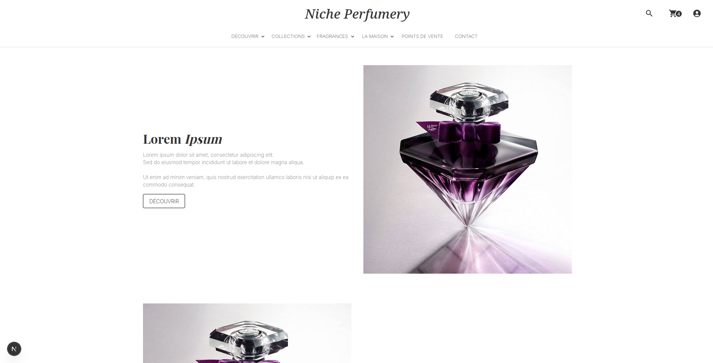
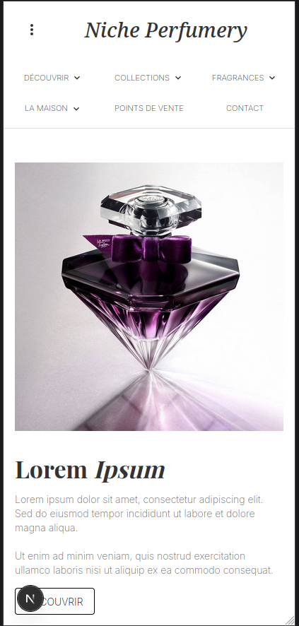
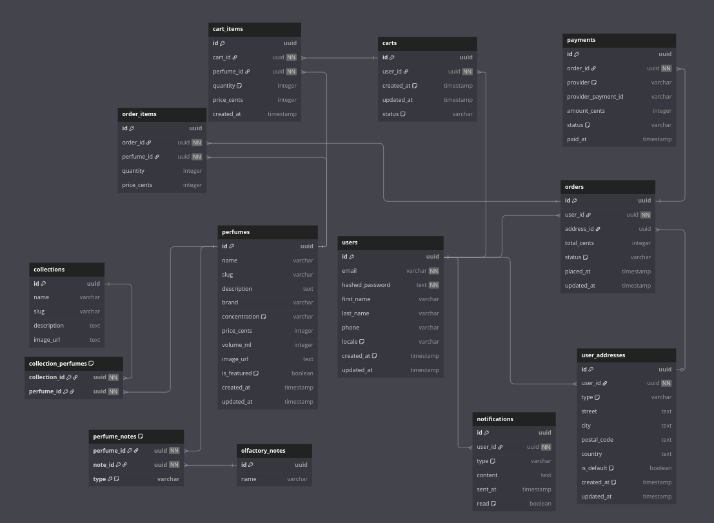

# NichePerfumeryTemplate

Modèle de site e-commerce de parfum de niche.

Ce projet est un modèle pour la création d'une plateforme de commerce spécialisée dans la vente de parfums de niche. Il fournit une architecture moderne, modulaire et testable pour développer un site performant, maintenable et extensible.

## **Aperçu**




---

## 1. Lancer le projet

### Prérequis

- Node.js ≥ 18.x
- PostgreSQL installé et une base de données accessible
- `npm` ou `pnpm` installé

### Étapes

```bash
# 1. Installer les dépendances
npm install

# 2. Initialiser Prisma (schéma + client)
npx prisma generate

# 3. Créer la base de données et lancer la première migration
npx prisma migrate dev --name init

# 4. Lancer le serveur de développement
npm run dev
```

---

## 2. Stack Technique

- **Framework fullstack** : [Next.js (App Router)](https://nextjs.org/docs/app)
- **Langage** : TypeScript
- **ORM** : Prisma
- **Base de données** : PostgreSQL
- **UI** : Material UI (MUI)
- **Architecture** : Hexagonale (Ports & Adapters)
- **Méthodologie** : Test-Driven Development (TDD), Clean Code

---

## 3. Architecture Hexagonale

Le projet est structuré selon les principes de l’**architecture hexagonale** :

- **Core (Domaine pur)** : entités, objets de valeur, interfaces, use-cases
- **Adapters** : exposition des cas d’utilisation via des routes API Next.js
- **Infrastructure** : implémentations concrètes des interfaces (accès DB, services externes)

Cette séparation garantit une forte maintenabilité, des tests isolés et une logique métier indépendante de la technologie.

---

## 4. Modules Fonctionnels

- **Authentification** : JWT, OAuth2 (Google, etc.)
- **Catalogue de parfums** : navigation par filtres
- **Panier** : ajout, suppression, quantité, persistance
- **Commandes & Paiements** : intégration Stripe / PayPal
- **Notifications** : emails transactionnels (confirmation commande, réinitialisation...)
- **Admin** : gestion des produits, stocks, commandes, utilisateurs

---

## 5. Schéma de la base de données



---

### Arborescence du projet

```bash
.
├── app/                   # App Router Next.js (routes/pages)
├── components/            # Composants UI MUI
├── core/                  # Domaine : entités, use-cases, ports
│   ├── domain/
│   ├── use-cases/
│   └── services/
├── adapters/             # Adapters (API, mappers, contrôleurs)
│   └── api/
├── infrastructure/       # DB, Prisma, services externes
│   ├── prisma/
│   ├── repositories/
│   └── services/
├── tests/                # Tests unitaires & intégration (TDD)
├── public/               # Fichiers statiques
├── .env                  # Configuration base de données
├── prisma/schema.prisma  # Schéma Prisma
├── package.json
└── tsconfig.json
```
